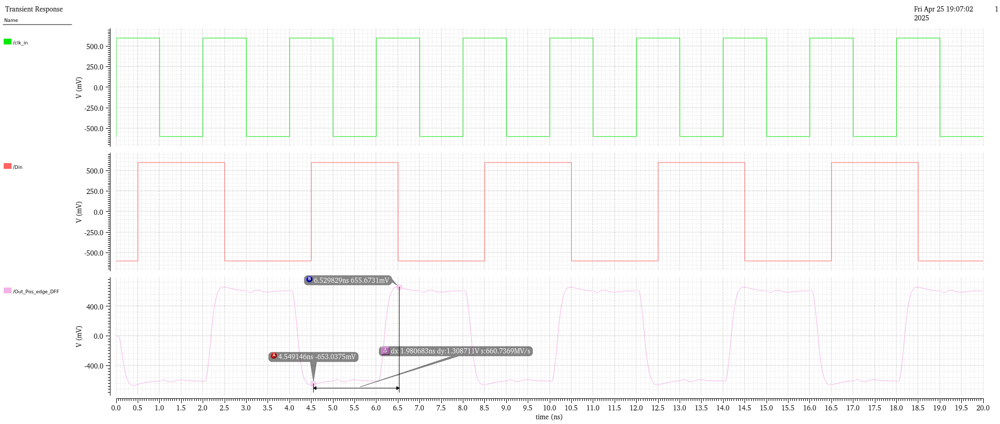

# Current Mode Logic (CML) Circuits – using 0.18um technology

Welcome to my repository showcasing a detailed collection of **Current Mode Logic (CML)** digital circuits, designed and simulated using **Cadence Virtuoso** at the **180 nm technology node**. This work demonstrates my systematic approach to high-speed differential logic design and my proficiency with industry-standard EDA flows.

---

## Table of Contents

1. [Why Current Mode Logic (CML)?](#why-current-mode-logic-cml)  
2. [Technology and Tools](#technology-and-tools)  
3. [Implemented Circuits](#implemented-circuits)  
   1. [CML Buffer / Inverter](#1-cml-buffer--inverter)  
   2. [CML NOR / OR Gate](#2-cml-nor--or-gate)  
   3. [CML AND / NAND Gate](#3-cml-and--nand-gate)  
   4. [2×1 CML Multiplexer](#4-2×1-cml-multiplexer)  
   5. [CML D Latch – Positive Level Triggered](#5-cml-d-latch–positive-level-triggered)  
   6. [CML D Latch – Negative Level Triggered](#6-cml-d-latch–negative-level-triggered)  
   7. [CML D Flip-Flop – Positive Edge Triggered](#7-cml-d-flip-flop–positive-edge-triggered)  
4. [Propagation Delay Observations](#propagation-delay-observations)  
5. [Conclusion](#conclusion)  
6. [Author](#author)  

---

## Why Current Mode Logic (CML)?

Although CMOS logic remains the ubiquitous choice for digital systems—thanks to its near-zero static power and design simplicity—its rail-to-rail switching and dynamic current spikes can hinder performance in ultra-high-speed or precision applications. **Current Mode Logic** addresses these limitations by:

- **Limiting Voltage Swing:** Only a small differential voltage is toggled, yielding faster transitions.  
- **Using Constant Current Biasing:** The tail current source provides a stable bias, reducing supply noise and limiting di/dt.  
- **Employing Differential Signaling:** Enhances noise immunity and signal integrity, critical in SerDes and clock distribution networks.  
- **Achieving High Throughput:** Ideal for multi-Gbps links, PLL clock drivers, and mixed-signal front-ends.  

These attributes make CML the architecture of choice for **high-frequency I/O, SerDes channels, and precision clocking circuits**.

---

## Technology and Tools

- **Process Technology:** 180 nm CMOS  
- **Design Environment:** Cadence Virtuoso v6.1.8  
- **Simulation Engine:** Spectre  
- **Design Style:** Differential current-steering pairs with NMOS tail-current sources  
- **Key Focus:** Delay optimization, signal fidelity, and robust biasing  

---

## Implemented Circuits

### 1. CML Buffer / Inverter

**Schematic:**  
|  | 
| :---: | 
| Fig 1: CML Buffer/Inverter Schematic |

|  | 
| :---: | 
| Fig 2: CML Buffer/Inverter Testbench |

#### ⚙️ Circuit Description

##### 🔷 Structure

- A differential pair of **NMOS transistors** controlled by inputs `inp` and `inn` as shown in Fig 1.
- A **bias NMOS current source** at the common source.
- Load devices (PMOS or resistors) pulling outputs toward VDD.
- Outputs: `outp` and `outn`.

##### 🔄 Logic Operation

| `inp` | `inn` | `outn` | `outp` | `outn - outp` (Inverter) | `outp - outn` (Buffer) |
|:-----:|:-----:|:------:|:------:|:-------------------------:|:----------------------:|
| High  | Low   | Low    | High   | Low                       | High                   |
| Low   | High  | High   | Low    | High                      | Low                    |

##### 🧠 Interpretation:

- **`outn - outp`** behaves like an **Inverter output**.
- **`outp - outn`** behaves like a **Buffer output**.
- Output voltage swings between **-600mV and +600mV** for both outputs.

**Transient Response:**  
|  | 
| :---: | 
| Fig 3: CML Buffer/Inverter Transient analysis |

*Thus, from the simulation results, it is clearly observable that both the CML inverter and buffer exhibit a very fast response with a propagation delay of just 65 ps and a differential swing of 1.2 V, resulting in significantly faster operation compared to conventional CMOS logic.*

### 2. CML NOR / OR Gate

**Schematic:**  
|  | 
| :---: | 
| Fig 4: CML NOR/OR Gate Schematic |

|  | 
| :---: | 
| Fig 5: CML NOR/OR Gate Testbench |

**Transient Response:**  
|  | 
| :---: | 
| Fig 6: CML NOR/OR Gate analysis |

Implements NOR and OR by steering currents through parallel differential branches. Ensures minimal skew between outputs.

### 3. CML AND / NAND Gate

**Schematic:**  
|  | 
| :---: | 
| Fig 7: CML NAND/AND Gate Schematic |

|  | 
| :---: | 
| Fig 8: CML NAND/AND Gate Testbench |

**Transient Response:**  
|  | 
| :---: | 
| Fig 9: CML NAND/AND Gate analysis |

Uses stacked differential pairs to realize AND/NAND logic. Carefully sized devices optimize fan-in versus speed trade-offs.

### 4. 2×1 CML Multiplexer

**Schematic:**  
|  | 
| :---: | 
| Fig 10: CML 2X1 Multiplexer Schematic |

|  | 
| :---: | 
| Fig 11: CML 2X1 Multiplexer Testbench |

**Transient Response:**  
|  | 
| :---: | 
| Fig 12: CML 2X1 Multiplexer analysis |

Selects one of two differential inputs. Highlights low-glitch switching and minimal propagation penalty.

### 5. CML D Latch – Positive Level Triggered

**Schematic:**  
|  | 
| :---: | 
| Fig 13: CML Positive level triggered D-latch schematic |

|  | 
| :---: | 
| Fig 14: CML Positive level triggered D-latch with buffer testbench |

**Transient Response:**  
|  | 
| :---: | 
| Fig 15: CML Positive level triggered D-latch analysis |

Samples input when clock is high; holds data when low. Demonstrates robust level-sensitive behavior.

### 6. CML D Latch – Negative Level Triggered

**Schematic:**  
|  | 
| :---: | 
| Fig 16: CML Negative level triggered D-latch schematic |

|  | 
| :---: | 
| Fig 17: CML Negative level triggered D-latch with buffer testbench |

**Transient Response:**  
|  | 
| :---: | 
| Fig 18: CML Negative level triggered D-latch analysis |

Complementary to the positive latch, sampling on clock low and holding on high.

### 7. CML D Flip-Flop – Positive Edge Triggered

**Schematic:**  
|  | 
| :---: | 
| Fig 19: CML Positive edge triggered D-flipflop schematic |

|  | 
| :---: | 
| Fig 20: CML Positive edge triggered D-flipflop testbench |

**Transient Response:**  
|  | 
| :---: | 
| Fig 21: CML Positive edge triggered D-flipflop analysis |

Master-slave configuration capturing data on the rising clock edge, combining two level-sensitive latches.

---

## Propagation Delay Observations

Below is a summary of the **propagation delays** I measured during transient simulation—these values reflect my performance optimizations and device sizing choices.

| **Circuit**                         | **Measured tpd** |
|------------------------------------|-----------------------------|
| CML Buffer / Inverter              | 64.65 ps                       |
| CML NOR / OR Gate                  | 127.8 ps                       |
| CML AND / NAND Gate                | 128 ps                       |
| 2×1 CML Multiplexer                | 133.8 ps                       |
| CML D Latch (Positive Level)       | 209.8 ps                       |
| CML D Latch (Negative Level)       | 213.3 ps                       |
| CML D Flip-Flop (Pos Edge Trigger) | 186.6 ps                       |

---

## Conclusion

This repository encapsulates my methodical exploration of CML logic, from fundamental gates to sequential elements. The designs highlight my skills in:

- High-speed differential circuit topology  
- Precision biasing and device sizing  
- Transient and noise-immunity optimization  

These building blocks serve as a solid foundation for complex SerDes channels, low-jitter clock distribution, and mixed-signal integration.

---

## Author

**Harshit Srivastava**  
Analog Design Engineer & VLSI Enthusiast  
[LinkedIn](#github.com/HarshitSri-Analog) • [Email](#harshitsri117@gmail.com)  

